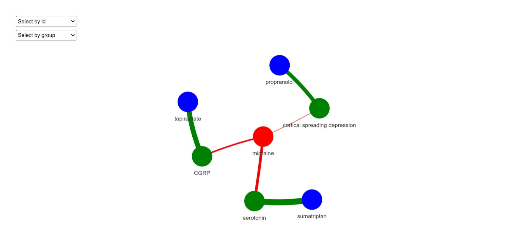
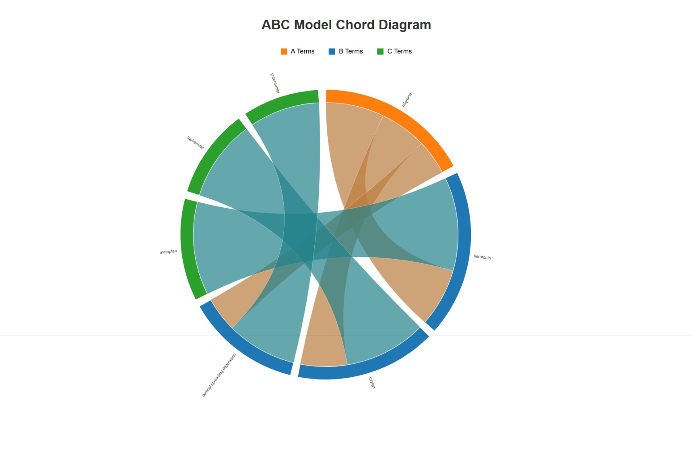

# LBDiscover: Literature-Based Discovery Tools for Biomedical Research

## Summary

LBDiscover is a comprehensive R package that provides tools for literature-based discovery (LBD) in biomedical research. The package integrates literature retrieval from NCBI databases, entity extraction from multiple knowledge sources, implementation of discovery models (ABC, ANC, BITOLA, and LSI), statistical validation, and interactive visualization capabilities. Unlike existing tools that often enforce strict entity type constraints, LBDiscover enables flexible cross-domain discovery while maintaining biomedical relevance through intelligent filtering.

## Statement of Need

Literature-based discovery, pioneered by Swanson in the 1980s, involves finding implicit relationships between biomedical concepts through their connections in scientific literature. As biomedical literature grows exponentially, computational approaches become essential for identifying novel hypotheses and accelerating scientific discovery. However, existing LBD tools present significant limitations: commercial solutions lack transparency and are expensive, while open-source alternatives require substantial programming expertise or impose restrictive constraints that limit cross-domain discoveries.

Researchers need accessible, flexible tools that can handle the complete LBD workflow—from literature retrieval through statistical validation and visualization—without requiring extensive bioinformatics expertise. LBDiscover addresses this need by providing a unified framework that democratizes access to sophisticated LBD methodologies.

## State of the Field

Several approaches exist for literature-based discovery, including web-based platforms like ARROWSMITH [@Smalheiser1998Arrowsmith] and specialized tools like FACTA+ [@Tsuruoka2008FACTA]. However, these tools often suffer from limited accessibility, lack of transparency, or constraints on entity types that may prevent valuable cross-domain discoveries. Open-source R packages like RISmed [@kovalchik2021rismed] provide literature retrieval capabilities but lack integrated discovery and validation frameworks.

LBDiscover fills this gap by providing a complete, transparent, and flexible LBD pipeline that researchers can customize and extend according to their specific needs.

## Software Functionality

LBDiscover implements six core functional modules:

### Literature Retrieval
The package interfaces with NCBI databases (PubMed, PMC) through optimized functions including `pubmed_search()` and `get_pmc_fulltext()`. Features include intelligent batching for large result sets, robust error handling with automatic retry mechanisms, persistent caching to avoid redundant API calls, and support for complex Boolean queries with MeSH term mapping.

### Text Preprocessing
Advanced text processing capabilities include vectorized preprocessing (`vec_preprocess()`), document similarity analysis (`calc_doc_sim()`), and K-means clustering (`cluster_docs()`) for understanding corpus structure before discovery analysis.

### Entity Extraction
The package supports multi-source entity extraction using local dictionaries, MeSH controlled vocabulary, and UMLS semantic networks. The `extract_entities_workflow()` function provides automated entity identification with validation, while maintaining flexibility across biomedical domains without enforcing strict type constraints.

### Discovery Models
LBDiscover implements four discovery approaches:
- **ABC Model** (`abc_model()`): Classical approach linking concepts A and C through intermediate concept B
- **ANC Model** (`anc_model()`): Enhanced model considering multiple intermediate terms simultaneously  
- **BITOLA Model** (`bitola_model()`): Semantic type filtering based on the BITOLA system
- **LSI Model** (`lsi_model()`): Latent semantic indexing for semantic similarity-based discovery

### Statistical Validation
Comprehensive validation includes hypergeometric testing (`validate_abc()`), permutation-based testing (`perm_test_abc()`), multiple testing correction options, and temporal validation (`abc_timeslice()`) using historical data to predict future connections.

### Visualization and Reporting
Interactive visualization tools include network diagrams (`vis_abc_network()`), heatmaps (`vis_heatmap()`), chord diagrams (`export_chord_diagram()`), and comprehensive HTML reports (`create_report()`) that combine all analysis results.

## Example Usage

The following demonstrates the use of `LBDiscover` for exploring migraine research connections, based on a working example from the package:

```r
library(LBDiscover)

# 1. Define the primary term of interest for our analysis
primary_term <- "migraine"

# 2. Retrieve articles related to migraine research
migraine_articles <- pubmed_search(
  query = paste0(primary_term, " pathophysiology"),
  max_results = 1000
)

# 3. Retrieve articles about drugs and treatments
drug_articles <- pubmed_search(
  query = "neurological drugs pain treatment OR migraine therapy OR headache medication",
  max_results = 1000
)

# 4. Combine articles and remove duplicates
all_articles <- merge_results(migraine_articles, drug_articles)

# 5. Extract variations of our primary term using the utility function
primary_term_variations <- get_term_vars(all_articles, primary_term)

# 6. Preprocess text
preprocessed_articles <- preprocess_text(
  all_articles,
  text_column = "abstract",
  remove_stopwords = TRUE,
  min_word_length = 2  # Set min_word_length to capture short terms
)

# 7. Create a custom dictionary with all variations of our primary term
custom_dictionary <- data.frame(
  term = c(primary_term, primary_term_variations),
  type = rep("disease", length(primary_term_variations) + 1),
  id = paste0("CUSTOM_", 1:(length(primary_term_variations) + 1)),
  source = rep("custom", length(primary_term_variations) + 1),
  stringsAsFactors = FALSE
)

# 8. Define additional MeSH queries for extended dictionaries
mesh_queries <- list(
  "disease" = paste0(primary_term, " disorders[MeSH] OR headache disorders[MeSH]"),
  "protein" = "receptors[MeSH] OR ion channels[MeSH]",
  "chemical" = "neurotransmitters[MeSH] OR vasoactive agents[MeSH]",
  "pathway" = "signal transduction[MeSH] OR pain[MeSH]",
  "drug" = "analgesics[MeSH] OR serotonin agonists[MeSH] OR anticonvulsants[MeSH]",
  "gene" = "genes[MeSH] OR channelopathy[MeSH]"
)

# 9. Sanitize the custom dictionary
custom_dictionary <- sanitize_dictionary(
  custom_dictionary,
  term_column = "term",
  type_column = "type",
  validate_types = FALSE 
)

# 10. Extract entities using our custom dictionary
custom_entities <- extract_entities(
  preprocessed_articles,
  text_column = "abstract",
  dictionary = custom_dictionary,
  case_sensitive = FALSE,
  overlap_strategy = "priority",
  sanitize_dict = FALSE  
)

# 11. Extract entities using the standard workflow with improved entity validation
standard_entities <- extract_entities_workflow(
  preprocessed_articles,
  text_column = "abstract",
  entity_types = c("disease", "drug", "gene"),
  parallel = TRUE,           # Enable parallel processing
  num_cores = 4,             # Use 4 cores
  batch_size = 500           # Process 500 documents per batch
)

# 12. Combine entity datasets using the utility function
entities <- merge_entities(
  custom_entities,
  standard_entities,
  primary_term
)

# 13. Filter entities to ensure only relevant biomedical terms are included
filtered_entities <- valid_entities(
  entities,
  primary_term,
  primary_term_variations,
  validation_function = is_valid_biomedical_entity
)

# 14. Create co-occurrence matrix with validated entities
co_matrix <- create_comat(
  filtered_entities,
  doc_id_col = "doc_id",
  entity_col = "entity",
  type_col = "entity_type",
  normalize = TRUE,
  normalization_method = "cosine"
)

# 15. Find our primary term in the co-occurrence matrix
a_term <- find_term(co_matrix, primary_term)

# 16. Apply the improved ABC model with term filtering and type validation
abc_results <- abc_model(
  co_matrix,
  a_term = a_term,
  c_term = NULL,  
  min_score = 0.001,  
  n_results = 500,    
  scoring_method = "combined",
  b_term_types = c("protein", "gene", "pathway", "chemical"),
  c_term_types = c("drug", "chemical", "protein", "gene"),
  exclude_general_terms = TRUE,  
  filter_similar_terms = TRUE,   
  similarity_threshold = 0.7,    
  enforce_strict_typing = TRUE   
)

# 17. Apply statistical validation to the results
validated_results <- tryCatch({
  validate_abc(
    abc_results,
    co_matrix,
    alpha = 0.1,  
    correction = "BH",  
    filter_by_significance = FALSE  
  )
}, error = function(e) {
  cat("Error in statistical validation:", e$message, "\n")
  cat("Using original results without validation...\n")
  abc_results$p_value <- 1 - abc_results$abc_score / max(abc_results$abc_score, na.rm = TRUE)
  abc_results$significant <- abc_results$p_value < 0.1
  return(abc_results)
})

# 18. Sort by ABC score and take top results
validated_results <- validated_results[order(-validated_results$abc_score), ]
top_n <- min(100, nrow(validated_results))  # Larger top N for diversification
top_results <- head(validated_results, top_n)

# 19. Diversify results using our utility function
diverse_results <- safe_diversify(
  top_results,
  diversity_method = "both",
  max_per_group = 5,
  min_score = 0.0001,
  min_results = 5
)

# 20. Ensure we have enough results for visualization
diverse_results <- min_results(
  diverse_results,
  top_results,
  a_term,
  min_results = 3
)

# 21. Create network visualization (see Figure 1)
export_network(
  diverse_results,
  output_file = "migraine_network.html",
  top_n = min(30, nrow(diverse_results)),
  min_score = 0.0001,
  open = FALSE  
)

# 22. Create chord diagram (see Figure 2)
export_chord(
  diverse_results,
  output_file = "migraine_chord.html",
  top_n = min(30, nrow(diverse_results)),
  min_score = 0.0001,
  open = FALSE
)
```
<figure style="text-align: center;">
  
  <figcaption><em>Figure 1. Network Visualization of the Results.</em></figcaption>
</figure>

<figure style="text-align: center;">
  
  <figcaption><em>Figure 2. Chord Diagram of the Results.</em></figcaption>
</figure>

This workflow demonstrates key features including multi-source literature retrieval, term variation extraction, custom dictionary creation, comprehensive entity validation, statistical significance testing with error handling, result diversification, and multiple visualization formats including static plots and interactive HTML outputs.

## Quality Assurance

LBDiscover includes comprehensive quality assurance measures:

- **Unit Testing**: Extensive test suite covering all major functions using testthat framework
- **Documentation**: Complete function documentation with examples and vignettes
- **Error Handling**: Robust error checking with informative messages and graceful degradation
- **Performance Optimization**: Parallel processing support and intelligent caching for scalability
- **Input Validation**: Comprehensive parameter validation to prevent common user errors

The package follows R development best practices including proper namespace management, dependency specification, and CRAN compatibility standards.

## Conclusion

LBDiscover addresses a critical need in biomedical research by providing the first comprehensive, open-source R package for literature-based discovery that combines literature retrieval, entity extraction, discovery modeling, statistical validation, and visualization in a unified framework. The package's key innovations include its entity-agnostic approach that enables cross-domain discovery without sacrificing biomedical relevance, comprehensive statistical validation capabilities, and integrated visualization tools. Future development will focus on incorporating advanced machine learning approaches, expanding knowledge source integration, and enhancing collaborative analysis capabilities.

## References