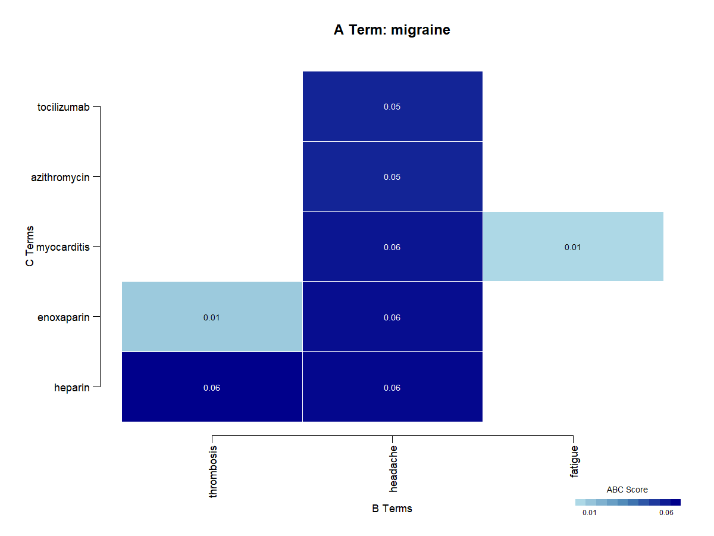

```{r setup, include = FALSE}
knitr::opts_chunk$set(
  collapse = TRUE,
  comment = "#>",
  fig.width = 7,
  fig.height = 5
)

# Create custom CSS file for better layout
cat("
body {
  max-width: 1200px;
  margin: 0 auto;
  padding: 0 10px;
}
.main-container {
  max-width: 100%;
  width: 100%;
}
table {
  width: 100%;
  max-width: 100%;
  font-size: 0.9em;
  overflow-x: auto;
  display: block;
}
th, td {
  padding: 4px 8px;
  white-space: nowrap;
}
pre {
  max-width: 100%;
  overflow-x: auto;
}
iframe {
  width: 100%;
  height: 800px;
  border: none;
}
/* Remove outer box lines */
.section {
  border: none !important;
  padding: 0 !important;
  margin-bottom: 20px !important;
}
/* Fix title and nav overlap */
h1.title {
  margin-top: 50px !important;
}
.navbar {
  margin-bottom: 40px !important;
}
#header {
  margin-bottom: 40px;
}
#TOC {
  margin-top: 30px;
  position: relative;
  z-index: 100;
}
/* Fix embedded report styles */
#migraine_discoveries {
  margin-top: 30px;
}
#migraine_discoveries .section {
  border: none !important;
  padding: 0 !important;
}
#migraine_discoveries .nav {
  position: relative !important;
  margin-bottom: 40px !important;
}
#migraine_discoveries .content {
  margin-top: 20px !important;
}
", file = "custom.css")
```

# Introduction

Literature-based discovery (LBD) is a powerful approach to identifying hidden connections between existing knowledge in the scientific literature. This vignette introduces the `LBDiscover` package, which provides tools for automated literature-based discovery by analyzing biomedical publications.

## Installation
You can install the package from CRAN:
```{r cran_installation, eval = FALSE}
install.packages("LBDiscover")
```

You can install the development version of `LBDiscover` from GitHub:
```{r github_installation, eval = FALSE}
# install.packages("devtools")
devtools::install_github("chaoliu-cl/LBDiscover")
```

## Basic Workflow

The typical workflow for literature-based discovery with this package consists of:

1. Retrieving publications from PubMed or other sources
2. Preprocessing text data
3. Extracting biomedical entities
4. Creating a co-occurrence matrix
5. Applying discovery models
6. Visualizing and evaluating results

Let's walk through a comprehensive example exploring connections in migraine research.

## Example: Exploring Migraine Research

In this example, we'll explore potential discoveries in migraine research by applying the improved ABC model approach with various utility functions.

### 1. Load the package

```{r load-package}
library(LBDiscover)
```

### 2. Define the primary term of interest

```{r define-primary-term}
# Define the primary term of interest for our analysis
primary_term <- "migraine"
```

### 3. Retrieve publications

We'll search for articles about migraine pathophysiology and treatment.

```{r retrieve-publications, eval = TRUE, message=FALSE}
# Search for migraine-related articles
migraine_articles <- pubmed_search(
  query = paste0(primary_term, " pathophysiology"),
  max_results = 1000
)

# Search for treatment-related articles
drug_articles <- pubmed_search(
  query = "neurological drugs pain treatment OR migraine therapy OR headache medication",
  max_results = 1000
)

# Combine and remove duplicates
all_articles <- merge_results(migraine_articles, drug_articles)
cat("Retrieved", nrow(all_articles), "unique articles\n")
```

### 4. Extract variations of the primary term

```{r extract-term-variations}
# Extract variations of our primary term using the utility function
primary_term_variations <- get_term_vars(all_articles, primary_term)
cat("Found", length(primary_term_variations), "variations of", primary_term, "in the corpus:\n")
print(head(primary_term_variations, 10))
```

### 5. Preprocess text data

```{r preprocess-text}
# Preprocess text
preprocessed_articles <- preprocess_text(
  all_articles,
  text_column = "abstract",
  remove_stopwords = TRUE,
  min_word_length = 2  # Set min_word_length to capture short terms
)
```

### 6. Create a custom dictionary

```{r create-custom-dictionary}
# Create a custom dictionary with all variations of our primary term
custom_dictionary <- data.frame(
  term = c(primary_term, primary_term_variations),
  type = rep("disease", length(primary_term_variations) + 1),
  id = paste0("CUSTOM_", 1:(length(primary_term_variations) + 1)),
  source = rep("custom", length(primary_term_variations) + 1),
  stringsAsFactors = FALSE
)

# Define additional MeSH queries for extended dictionaries
mesh_queries <- list(
  "disease" = paste0(primary_term, " disorders[MeSH] OR headache disorders[MeSH]"),
  "protein" = "receptors[MeSH] OR ion channels[MeSH]",
  "chemical" = "neurotransmitters[MeSH] OR vasoactive agents[MeSH]",
  "pathway" = "signal transduction[MeSH] OR pain[MeSH]",
  "drug" = "analgesics[MeSH] OR serotonin agonists[MeSH] OR anticonvulsants[MeSH]",
  "gene" = "genes[MeSH] OR channelopathy[MeSH]"
)

# Sanitize the custom dictionary
custom_dictionary <- sanitize_dictionary(
  custom_dictionary,
  term_column = "term",
  type_column = "type",
  validate_types = FALSE  # Don't validate custom terms as they're trusted
)
```

### 7. Extract biomedical entities

```{r extract-entities, message=FALSE}
# Extract entities using our custom dictionary
custom_entities <- extract_entities(
  preprocessed_articles,
  text_column = "abstract",
  dictionary = custom_dictionary,
  case_sensitive = FALSE,
  overlap_strategy = "priority",
  sanitize_dict = FALSE  # Already sanitized
)

# Extract entities using the standard workflow with improved entity validation
# Check if running in R CMD check environment
is_check <- !interactive() && 
            (!is.null(Sys.getenv("R_CHECK_RUNNING")) && 
             Sys.getenv("R_CHECK_RUNNING") == "true")
             
# More robust check for testing environment
if (!is_check && !is.null(Sys.getenv("_R_CHECK_LIMIT_CORES_"))) {
  is_check <- TRUE
}

# Set number of cores based on environment
num_cores_to_use <- if(is_check) 1 else 4

standard_entities <- extract_entities_workflow(
  preprocessed_articles,
  text_column = "abstract",
  entity_types = c("disease", "drug", "gene"),
  parallel = !is_check,           # Disable parallel in check environment
  num_cores = num_cores_to_use,   # Use 1 core in check environment
  batch_size = 500                # Process 500 documents per batch
)

# Uncomment to include UMLS entities
# standard_entities <- extract_entities_workflow(
#   preprocessed_articles,
#   text_column = "abstract",
#   entity_types = c("disease", "drug", "gene", "protein", "pathway", "chemical"),
#   dictionary_sources = c("local", "mesh", "umls"),  # Including UMLS
#   additional_mesh_queries = mesh_queries,
#   sanitize = TRUE,
#   api_key = "your-umls-api-key",  # Your UMLS API key here
#   parallel = TRUE,
#   num_cores = 4
# )

# Combine entity datasets using our utility function
entities <- merge_entities(
  custom_entities,
  standard_entities,
  primary_term
)

# Filter entities to ensure only relevant biomedical terms are included
filtered_entities <- valid_entities(
  entities,
  primary_term,
  primary_term_variations,
  validation_function = is_valid_biomedical_entity
)

# View the first few extracted entities
head(filtered_entities)
```

### 8. Create co-occurrence matrix

```{r co-occurrence-matrix}
# Create co-occurrence matrix with validated entities
co_matrix <- create_comat(
  filtered_entities,
  doc_id_col = "doc_id",
  entity_col = "entity",
  type_col = "entity_type",
  normalize = TRUE,
  normalization_method = "cosine"
)

# Find our primary term in the co-occurrence matrix
a_term <- find_term(co_matrix, primary_term)

# Check matrix dimensions
dim(co_matrix)
```

### 9. Apply the improved ABC model

```{r abc-model}
# Apply the improved ABC model with enhanced term filtering and type validation
abc_results <- abc_model(
  co_matrix,
  a_term = a_term,
  c_term = NULL,  # Allow all potential C terms
  min_score = 0.001,  # Lower threshold to capture more potential connections
  n_results = 500,    # Increase to get more candidates before filtering
  scoring_method = "combined",
  # Focus on biomedically relevant entity types
  b_term_types = c("protein", "gene", "pathway", "chemical"),
  c_term_types = c("drug", "chemical", "protein", "gene"),
  exclude_general_terms = TRUE,  # Enable enhanced term filtering
  filter_similar_terms = TRUE,   # Remove terms too similar to migraine
  similarity_threshold = 0.7,    # Relatively strict similarity threshold
  enforce_strict_typing = TRUE   # Enable strict entity type validation
)

# If we don't have enough results, try with less stringent criteria
min_desired_results <- 10
if (nrow(abc_results) < min_desired_results) {
  cat("Not enough results with strict filtering. Trying with less stringent criteria...\n")
  abc_results <- abc_model(
    co_matrix,
    a_term = a_term,
    c_term = NULL,
    min_score = 0.0005,  # Even lower threshold
    n_results = 500,
    scoring_method = "combined",
    b_term_types = NULL,  # No type constraints
    c_term_types = NULL,  # No type constraints
    exclude_general_terms = TRUE,
    filter_similar_terms = TRUE,
    similarity_threshold = 0.8,    # More lenient similarity threshold
    enforce_strict_typing = FALSE  # Disable strict type validation as fallback
  )
}

# View top results
head(abc_results[, c("a_term", "b_term", "c_term", "abc_score", "b_type", "c_type")])
```

### 10. Apply statistical validation to the results

```{r validate-results}
# Apply statistical validation to the results
validated_results <- tryCatch({
  validate_abc(
    abc_results,
    co_matrix,
    alpha = 0.1,  # More lenient significance threshold
    correction = "BH",  # Benjamini-Hochberg correction for multiple testing
    filter_by_significance = FALSE  # Keep all results but mark significant ones
  )
}, error = function(e) {
  cat("Error in statistical validation:", e$message, "\n")
  cat("Using original results without validation...\n")
  # Add dummy p-values based on ABC scores
  abc_results$p_value <- 1 - abc_results$abc_score / max(abc_results$abc_score, na.rm = TRUE)
  abc_results$significant <- abc_results$p_value < 0.1
  return(abc_results)
})

# Sort by ABC score and take top results
validated_results <- validated_results[order(-validated_results$abc_score), ]
top_n <- min(100, nrow(validated_results))  # Larger top N for diversification
top_results <- head(validated_results, top_n)

# View top validated results
head(top_results[, c("a_term", "b_term", "c_term", "abc_score", "p_value", "significant")])
```

### 11. Diversify and ensure minimum results

```{r diversify-results}
# Diversify results using our utility function
diverse_results <- safe_diversify(
  top_results,
  diversity_method = "both",
  max_per_group = 5,
  min_score = 0.0001,
  min_results = 5
)

# Ensure we have enough results for visualization
diverse_results <- min_results(
  diverse_results,
  top_results,
  a_term,
  min_results = 3
)
```

### 12. Visualize the results

```{r visualization}
# Create heatmap visualization
plot_heatmap(
  diverse_results,
  output_file = "migraine_heatmap.png",
  width = 1200,
  height = 900,
  top_n = 15,
  min_score = 0.0001,
  color_palette = "blues",
  show_entity_types = TRUE
)

# Create network visualization
plot_network(
  diverse_results,
  output_file = "migraine_network.png",
  width = 1200,
  height = 900,
  top_n = 15,
  min_score = 0.0001,
  node_size_factor = 5,
  color_by = "type",
  title = "Migraine Treatment Network",
  show_entity_types = TRUE,
  label_size = 1.0
)
```

### 13. Create interactive visualizations

```{r interactive-visualizations}
# Create interactive HTML network visualization
export_network(
  diverse_results,
  output_file = "migraine_network.html",
  top_n = min(30, nrow(diverse_results)),
  min_score = 0.0001,
  open = FALSE  # Don't automatically open in browser
)

# Create interactive chord diagram
export_chord(
  diverse_results,
  output_file = "migraine_chord.html",
  top_n = min(30, nrow(diverse_results)),
  min_score = 0.0001,
  open = FALSE
)
```

### 14. Evaluate literature support and generate report

```{r evaluation-report, message=FALSE}
# Evaluate literature support for top connections
evaluation <- eval_evidence(
  diverse_results,
  max_results = 5,
  base_term = "migraine",
  max_articles = 5
)

# Prepare articles for report generation
articles_with_years <- prep_articles(all_articles)

# Store results for report
results_list <- list(abc = diverse_results)

# Store visualization paths
visualizations <- list(
  heatmap = "migraine_heatmap.png",
  network = "migraine_network.html",
  chord = "migraine_chord.html"
)

# Create comprehensive report
gen_report(
  results_list = results_list,
  visualizations = visualizations,
  articles = articles_with_years,
  output_file = "migraine_discoveries.html"
)

cat("\nDiscovery analysis complete!\n")
```

## Interactive Visualizations and Report

The LBDiscover package generates interactive visualizations and a comprehensive report. Below you can see the embedded report with interactive visualizations.

```{r preprocess-report, echo=FALSE, results='hide', eval=TRUE}
if(file.exists("migraine_discoveries.html")) {
  # Read the HTML file
  report_html <- readLines("migraine_discoveries.html", warn = FALSE)
  
  if(file.exists("migraine_heatmap.png")) {
    # Encode the image to base64
    base64_img <- base64enc::base64encode("migraine_heatmap.png")
    report_html <- gsub(
      "",
      paste0(""),
      report_html,
      fixed = TRUE
    )
  }
  
  # Add JavaScript to handle link clicks directly in the report
  js_code <- '
<script>
function navigateToSection(sectionId) {
  window.parent.postMessage({
    type: "scrollTo",
    id: sectionId
  }, "*");
}
</script>'
  
  # Insert the JavaScript before the closing body tag
  report_html <- gsub('</body>', paste0(js_code, '</body>'), report_html)
  
  report_html <- gsub(
    '<a href=\'migraine_network.html\' target=\'_blank\'>Open Network Visualization</a>', 
    '<a href=\"javascript:void(0)\" onclick=\"navigateToSection(\'network-visualization\')\" style=\"color: #0066cc; text-decoration: underline; cursor: pointer;\">View Network Visualization Below</a>', 
    report_html, fixed = TRUE
  )
  
  report_html <- gsub(
    '<a href=\'migraine_chord.html\' target=\'_blank\'>Open Chord Diagram</a>', 
    '<a href=\"javascript:void(0)\" onclick=\"navigateToSection(\'chord-diagram\')\" style=\"color: #0066cc; text-decoration: underline; cursor: pointer;\">View Chord Diagram Below</a>', 
    report_html, fixed = TRUE
  )
  
  report_html <- gsub(
    'The network visualization is available as a separate interactive visualization. <a href="migraine_network.html" target="_blank">.*?</a>', 
    'The network visualization is <a href=\"javascript:void(0)\" onclick=\"navigateToSection(\'network-visualization\')\" style=\"color: #0066cc; text-decoration: underline; cursor: pointer;\">available below</a>.', 
    report_html
  )
  
  report_html <- gsub(
    'The chord diagram is available as a separate visualization. <a href="migraine_chord.html" target="_blank">.*?</a>', 
    'The chord diagram is <a href=\"javascript:void(0)\" onclick=\"navigateToSection(\'chord-diagram\')\" style=\"color: #0066cc; text-decoration: underline; cursor: pointer;\">available below</a>.', 
    report_html
  )
  
  report_html <- gsub(
    '<div style=\'width:100%; height:600px;\'>\\s*<iframe src=\'migraine_network.html\' width=\'100%\' height=\'100%\' style=\'border:none;\'></iframe>\\s*</div>', 
    '<div style="margin-top: 20px; margin-bottom: 20px; padding: 20px; background-color: #f8f9fa; border-radius: 5px; text-align: center;">Network visualization is available in a separate section below the report.</div>', 
    report_html
  )
  
  report_html <- gsub(
    '<div style=\'width:100%; height:600px;\'>\\s*<iframe src=\'migraine_chord.html\' width=\'100%\' height=\'100%\' style=\'border:none;\'></iframe>\\s*</div>', 
    '<div style="margin-top: 20px; margin-bottom: 20px; padding: 20px; background-color: #f8f9fa; border-radius: 5px; text-align: center;">Chord diagram is available in a separate section below the report.</div>', 
    report_html
  )
  
  # Write the modified file
  writeLines(report_html, "migraine_discoveries_modified.html")
}
```

### Embedding HTML Report in the Vignette

```{r embed-report, echo=FALSE, results='asis', eval=TRUE}
report_file <- if(file.exists("migraine_discoveries_modified.html")) {
  "migraine_discoveries_modified.html"
} else {
  "migraine_discoveries.html"
}

cat(sprintf('<iframe src="%s" width="100%%" height="800px" style="border: 1px solid #ddd; border-radius: 5px;"></iframe>', report_file))
```

### Direct Links to Interactive Visualizations

The interactive visualizations are embedded below:

```{r network-visualization, echo=FALSE, results='asis', eval=TRUE}
cat('<div id="network-visualization" style="margin-top: 20px; margin-bottom: 30px;">')
cat('<h4>Network Visualization</h4>')
cat('<iframe id="network-viz-iframe" src="migraine_network.html" width="100%" height="600px" style="border: 1px solid #ddd; border-radius: 5px;"></iframe>')
cat('</div>')
```

```{r chord-visualization, echo=FALSE, results='asis', eval=TRUE}
cat('<div id="chord-diagram" style="margin-top: 30px; margin-bottom: 30px;">')
cat('<h4>Chord Diagram</h4>')
cat('<iframe id="chord-viz-iframe" src="migraine_chord.html" width="100%" height="600px" style="border: 1px solid #ddd; border-radius: 5px;"></iframe>')
cat('</div>')
```

```{r js-script, echo=FALSE, results='asis', eval=TRUE}
# Add JavaScript to listen for messages from the embedded report
cat('<script>
// Listen for messages from the iframe
window.addEventListener("message", function(e) {
  if (e.data && e.data.type === "scrollTo") {
    const targetId = e.data.id;
    const targetElement = document.getElementById(targetId);
    
    if (targetElement) {
      // Get the element\'s position relative to the viewport
      const rect = targetElement.getBoundingClientRect();
      const isVisible = (
        rect.top >= 0 &&
        rect.left >= 0 &&
        rect.bottom <= window.innerHeight &&
        rect.right <= window.innerWidth
      );
      
      // If not visible, scroll to it
      if (!isVisible) {
        targetElement.scrollIntoView({ 
          behavior: "smooth", 
          block: "start",
          inline: "nearest"
        });
        
        // Add offset for fixed headers if needed
        setTimeout(() => {
          window.scrollBy(0, -20);
        }, 500);
      }
    }
  }
}, false);

// Also handle direct hash navigation
window.addEventListener("DOMContentLoaded", function() {
  if (window.location.hash) {
    const targetElement = document.querySelector(window.location.hash);
    if (targetElement) {
      targetElement.scrollIntoView({ behavior: "smooth" });
    }
  }
});
</script>')
```

## Advanced Features

The `LBDiscover` package offers several advanced features that we've demonstrated in this example:

1. **Term variation detection**: Automatically finding different forms of your primary term of interest
2. **Custom dictionary integration**: Creating and using custom dictionaries alongside standard ones
3. **Entity validation**: Filtering entities to ensure biomedical relevance
4. **Improved ABC model**: Enhanced scoring methods and filtering options
5. **Statistical validation**: Applying rigorous statistical tests to potential discoveries
6. **Result diversification**: Ensuring a diverse set of discovery candidates
7. **Interactive visualizations**: Creating dynamic network and chord diagrams
8. **Evidence evaluation**: Assessing the literature support for discoveries
9. **Comprehensive reporting**: Generating detailed HTML reports of findings

## Conclusion

This vignette has demonstrated a comprehensive workflow for literature-based discovery using the `LBDiscover` package. The improved ABC model and additional utility functions provide a robust framework for identifying potential novel connections in biomedical literature. Users can explore examples that are included in the `inst\examples` folder.

```{r save-vignette-assets, echo=FALSE, eval=FALSE}
# This code block is not run by default but shows how to copy the generated files
# to the vignette directory for proper rendering when building the package
if(file.exists("migraine_discoveries_modified.html")) {
  file.copy("migraine_discoveries_modified.html", 
            file.path(system.file("doc", package = "LBDiscover"), "migraine_discoveries_modified.html"), 
            overwrite = TRUE)
} else if(file.exists("migraine_discoveries.html")) {
  file.copy("migraine_discoveries.html", 
            file.path(system.file("doc", package = "LBDiscover"), "migraine_discoveries.html"), 
            overwrite = TRUE)
}
if(file.exists("migraine_network.html")) {
  file.copy("migraine_network.html", 
            file.path(system.file("doc", package = "LBDiscover"), "migraine_network.html"), 
            overwrite = TRUE)
}
if(file.exists("migraine_chord.html")) {
  file.copy("migraine_chord.html", 
            file.path(system.file("doc", package = "LBDiscover"), "migraine_chord.html"), 
            overwrite = TRUE)
}
if(file.exists("migraine_heatmap.png")) {
  file.copy("migraine_heatmap.png", 
            file.path(system.file("doc", package = "LBDiscover"), "migraine_heatmap.png"), 
            overwrite = TRUE)
}

# Copy the custom CSS file
if(file.exists("custom.css")) {
  file.copy("custom.css", 
            file.path(system.file("doc", package = "LBDiscover"), "custom.css"), 
            overwrite = TRUE)
}
```
